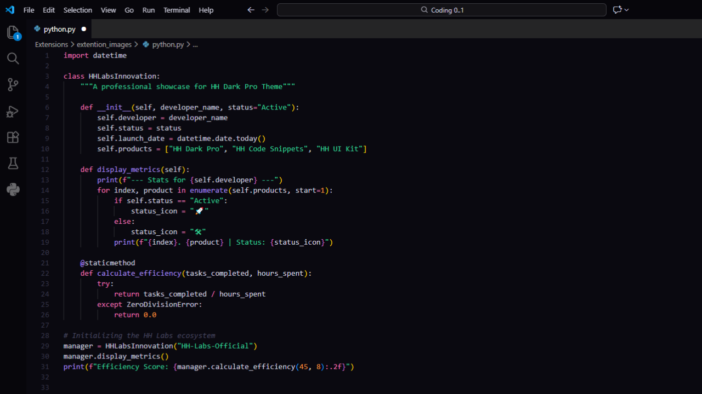
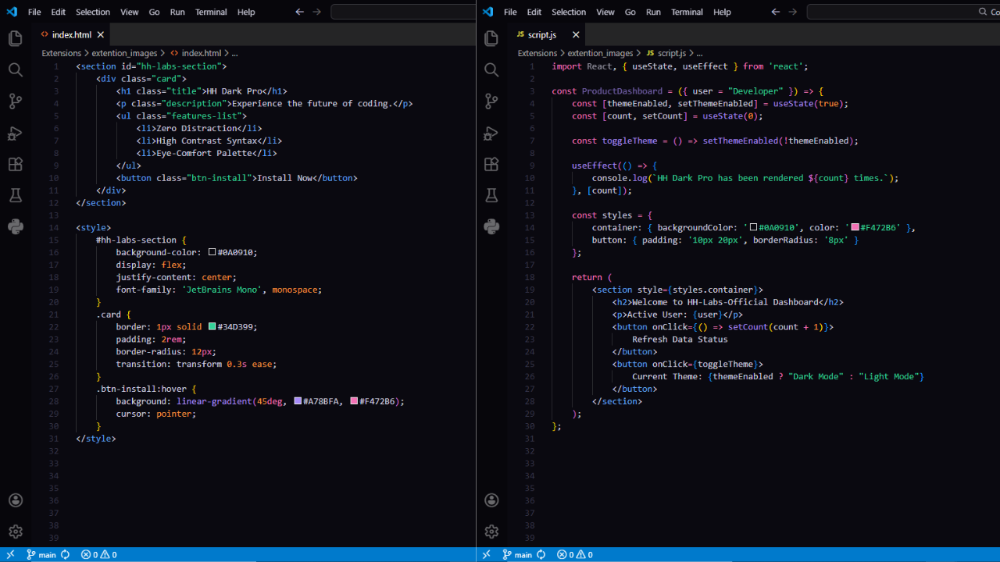

# HH Dark Pro 🚀

**HH Dark Pro** is a premium-feel, super matte dark theme meticulously crafted for modern developers. Designed by **HH-Labs**, it focuses on reducing eye strain while making your syntax pop with vibrant, high-contrast colors.

---

## 🎨 Preview

### Full Workspace View

### Syntax Highlighting (Modern Languages)

---

## ✨ Key Features

* **Super Matte Palette:** A deep `#0A0910` background that eliminates distractions.
* **Vibrant Syntax:** Carefully selected colors for Functions (`#A78BFA`), Keywords (`#F472B6`), and Strings (`#34D399`).
* **Professional UI:** Clean sidebars, subtle borders, and an aesthetic activity bar.
* **Universal Language Support:** Optimized for Python, JavaScript, TypeScript, React, C++, SQL, HTML/CSS, and more.
* **Accessible:** High contrast ratios for better readability during long coding sessions.

---

## 🛠 Installation

1.  Open **Visual Studio Code**.
2.  Go to the **Extensions** view (`Ctrl+Shift+X`).
3.  Search for `HH Dark Pro`.
4.  Click **Install**.
5.  Navigate to `File > Preferences > Theme > Color Theme` and select **HH Dark Pro**.

---

## 🚀 Connect & Learn

**HH-Labs** is dedicated to building high-quality developer tools and resources. Follow our journey and learn coding with us:

* **📺 YouTube:** [HH Tech Services](https://youtube.com/@hh_tech_services?si=YOMMangXmb2O0SJK) — Tutorials on Coding & Tech.
* **📂 GitHub:** [@HH-Labs-Official](https://github.com/HH-Labs-Official) — Open source projects and themes.

---

## 📄 License

This project is licensed under the [MIT License](LICENSE.md).

---

**Crafted with ❤️ by HH-Labs for the Developer Community.**